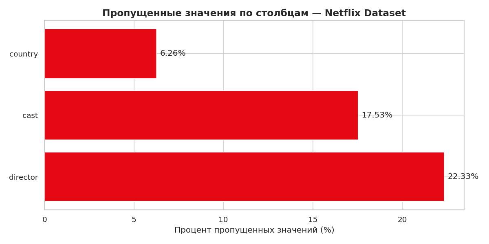
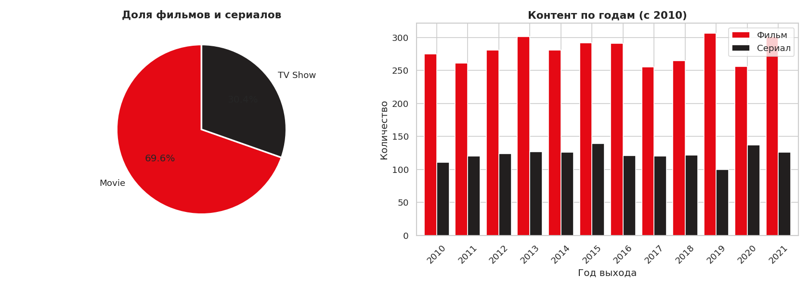
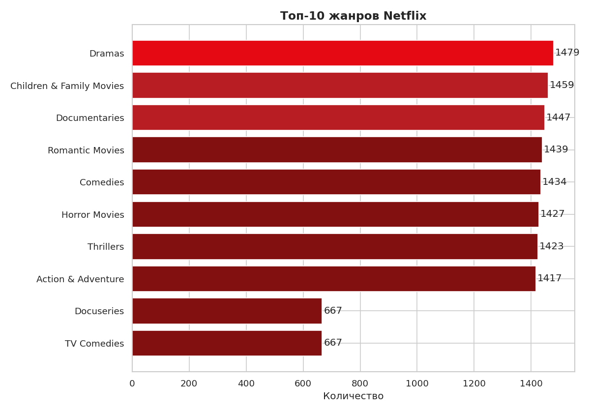
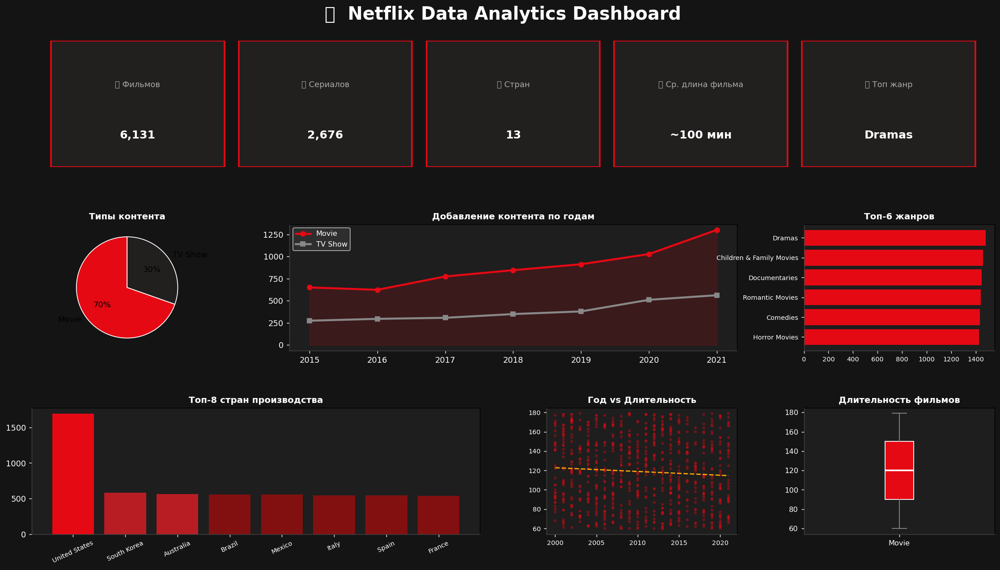

# Анализ и визуализация данных контента Netflix

## Структура проекта
- `data/` — папка для датасетов
- `img/` — графики и скриншоты проекта
- `notebooks/` — рабочие блокноты Jupyter

## Ход выполнения (Неделя 1-2)
1. Создан и настроен репозиторий на GitHub.
2. Сформирована базовая структура проекта в редакторе.
3. Подготовлены и загружены визуализации для анализа пропущенных значений, распределения контента и структуры дашборда.

---

## Результаты первичного анализа данных

### 1. Анализ пропущенных данных
Проведен разведочный анализ данных (EDA) на предмет пропусков. Наибольшее количество пропущенных значений зафиксировано в признаках `director` (22.33%) и `cast` (17.53%). В столбце `country` пропущено 6.26% данных. На этапе предобработки планируется заполнение данных пропусков текстовыми заглушками для сохранения целостности датасета.

### 2. Распределение типов контента и динамика по годам
Анализ соотношения медиаконтента показал, что фильмы составляют подавляющую часть платформы — 69.6%, в то время как на сериалы (TV Show) приходится 30.4%. Начиная с 2015–2016 годов, наблюдается резкий и стабильный рост ежегодного добавления как фильмов, так и сериалов, что свидетельствует о переходе компании к стратегии производства собственного контента.

### 3. Топ-10 популярных жанров
Сформирован рейтинг ключевых жанров на платформе Netflix. Лидирующие позиции занимают драмы (1479 единиц), детские и семейные фильмы (1459 единиц), а также документальное кино (1447 единиц). Комедии и хорроры идут с минимальным отрывом.

### 4. Общий вид интерактивного дашборда
Разработан концепт интерактивного дашборда (Netflix Data Analytics Dashboard) для верхнеуровневого мониторинга метрик: общего количества фильмов (6,131) и сериалов (2,676), географического охвата (13 ключевых стран) и средней длительности кинокартин (~100 минут).

